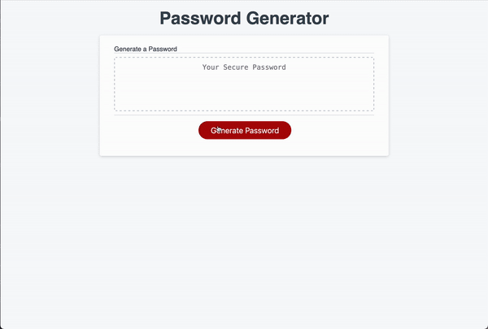

# Password Generator

## Description 
The goal of this project was to create a Password Generator. The user was to be presented a button,
that when pressed would present a series of prompts to the user. The user would choose the types of 
characters to include in their password. The options were capital and lowercase alphanumeric keys, as well
as the option to include special characters. The styling and layout of the page were provided, so as a developer
I needed to ensure that all of my work fit into the site, and did not change the outward appearance.

## Link and Preview of the site

[Click to view the live application](https://sharkby7e.github.io/passwordGenerator/)



## Technologies Employed

| Techlogy   | Implementation/Use          |
|:----------:|-----------------------------|
|HTML        | Structure of Webpage        |
|CSS         | Styling of Application      |
|JavaScript  | Internal Logic/functionality|

## User Guide 
The application is quite intuitive, and accounts for any errors that may occur while using. 
When prompted, the user gives the length they wish their password to be. If they don't meet the given
criteria, they are asked to read the prompt again, and make sure what they input works. 

After the length has been input, then the user is prompted whether or not to include the 4 character types
* Capital Letters
* Lowercase Letters
* Special Characters
* Numerical Characters

If the user does not confirm at least one of the types, they are notified, and the process starts over.
The application was designed such that the user would not receive their password until the correct criteria were given.

## Key Functions
This was the function that runs when you press the big red button on the page.
It contains the for loop for generating the random password from the character types selected by the user. 
The promptUser function is called within, which is detailed below

### generatePassword
```javascript
function generatePassword() {
  options = ""
  var pass = ""
  promptUser()
  for (let i = 0; i < len; i++) {
    var optLen = options.length
    var character = options[Math.floor(Math.random()*optLen)]
    pass+= character
  }
  return pass
}
```

This function contains calls to the 5 functions that prompt the user to select the length of their code,
as well as the character types they wish to include. If confirmed, those functions also added their respective characters to the "options" string, which would be later employed to generate the password.
It also calls a final function that ensures that at least
one of the types was selected, ensuring that the app could function correctly

### promptUser
```javascript
function promptUser(){
  howLong()
  var cap = caps()
  var low = lowers()
  var spe = specials()
  var num =nums()
  validateChoices(cap,low,spe,num)
}
```
## Summary and Learning Points
This project was a fun lesson in creating smaller modular functions, and piecing them together. 
"Many hands make light work," goes the old saying, and this application showcases that. 
This also made testing and debugging a lot easier, because I was able to isolate different parts, 
and find where the issues were occuring. This password generator really _secured_ my belief in writing 
functions that have a singular and obvious puropse. 
